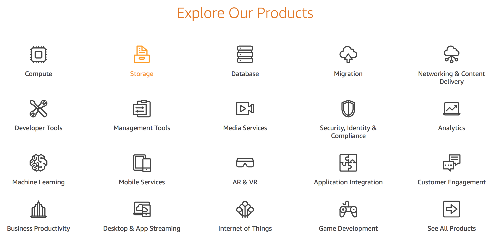
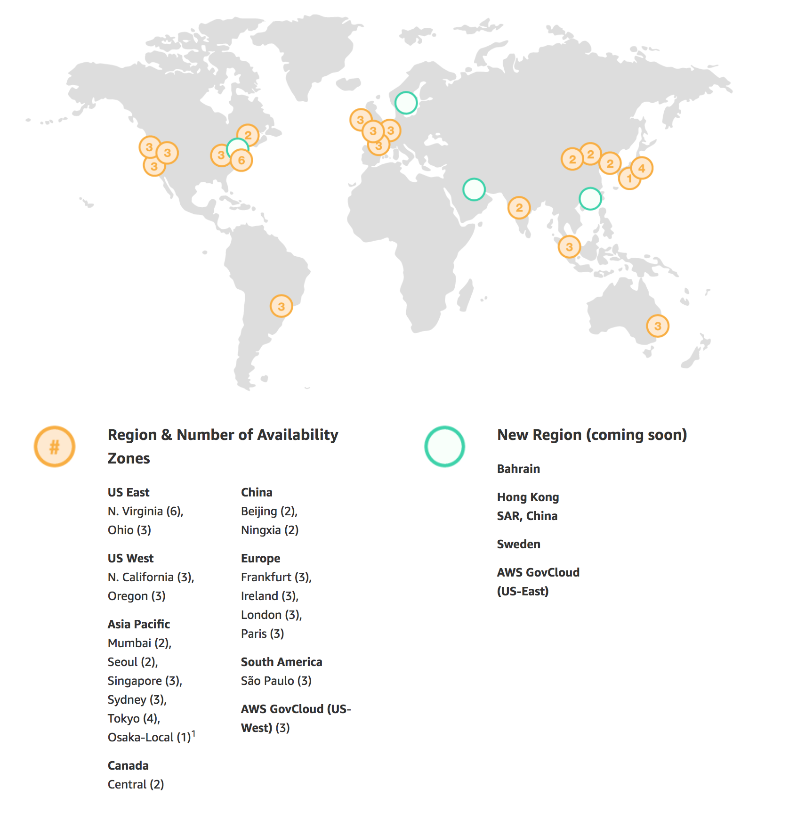

# AWS Certified Developer Associate - 2018

## What am I getting into?

| Domain                   |      Percentage |
| :-------------:          | :-------------: |
| AWS Fundamentals         |             10% |
| Designing and Developing |             40% |
| Deployment and Security  |             30% |
| Debugging                |             20% |

## Some History -- Not needed but good to know

- 2003 - Chris Pinkhan & Benjamin Black presented a paper on what Amazon's own internal infrastructure should look like

- Suggested selling it as a server and prepared a business case

- 2004 - SQS officially launched - First AWS Service

- 2006 - AWS officially launched

- 2007 - over 180,000 devs on the platform

- 2010 - all of amazon.com moved over

- 2012 - First re:Invent Conference

- 2013 - First AWS Certification Launched

- 2015 - Break even at $6 Billion USD and growing close to 90%/year

- 2016 - Run rate of $13 billion USD

## 10,000 Foot Overview

### Global Infrastructure

- 16 Regions
- 44 Availability Zones - As of December 2017
- 6 More Regions and and 17 AZ coming in for 2018
- You won't be tested on numbers, just concepts.

**What is a Region?**

A region is geographical area. Each Region consists of 2 (or more** Availability Zones. Example: Orgeon, N. Virginia, Sydney, etc.

**What is an Availability Zone (AZ)?**

An availability zone is simply a data center. You want to put your resources in multiple AZs, so you still have your data if one of them get hits by the floods.

**What is an Edge Location?**

Edge Locations are endpoints for AWS which are used for chaching content. Typically this consists of CloudFront, Amazon's Content Delivery Network (CDN**. We'll create our own CDN soon.

There are more edge locations than regions -- 96.

**For Exam:**

Understand the difference between a region, an AZ and an Edge Location

- A region is a physical location in the world which consists of two or more AZs.

- An AZ is one or more discrete data centers, each with redundant power, networking and connectivity, housed in sperate facilities.

- Edge Locations are endpoints for AWS which are used for caching content. Typically this consists of CloudFront, Amazon's Content Delivery Network (CDN).
