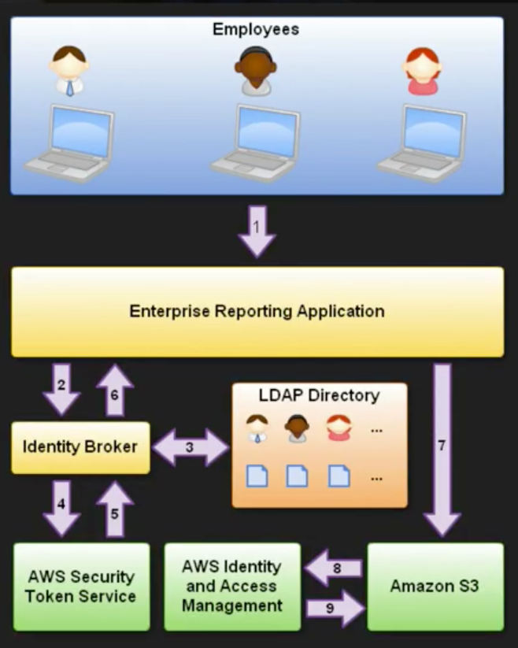

# IAM - Identity Access Management

## IAM 101

- IAM allows you to manage users and their level of access to the AWS Console. It is important to understand IAM and how it works, both for the exam and for administrating a company's AWS account in real life.

- What does IAM give you?
  - Centralised control of your AWS account
  - Shared Access to your AWS account
  - Granular Permissions
  - Identity Federation (including AD, Facebook, Liunedin, etc).
  - Multifactor Authentication
  - Provide termporary access for users/devices and services where necessary (mobile phone app that can temporarily access your AWS account to store things on DB or S3)
  - Allows you to set up your own password rotation policy
  - Integrates with many different AWS services
  - Supports PCI DSS Compliance

- Critial Terms:
  - Users - End Users (think people)
  - Groups - A collection of users under one set of permissions (Finance, HR, Sys Admin Groups).
  - Roles - You create roles and can then assign them to AWS resources. EC2 instance (viratual machine) gets a role to access S3, so that VM can directly read/write to S3 instead of creating a username/password.
  - Policy - A document that defines one (or more) permissions. Can attach a policy to user, group or role.

## IAM Lab

- Select Reagion Closest to you from top right corner (beside your username)
- On top you'll see Services section and select IAM under Securit, Identity & Compliance
- Notice: On top, the region is switched to Global. This is because IAM service that is applied globally and is not specific to any regions
- IAM users sign-in link:
  - You can customize it to something that you can remember

- Security Status:
  - MFA on your root account
    - Explain root account (account you created using your email address)
    - Root account gives you unlimited access
    - Dont want all your employees to have that level of permission
    - Only ever login into root account once or twice
    - Create users and groups for everything
    - Enable MFA!! -> Kind of intuitive
  - Create Individual users
    - One for yourself and one 'Jane Doe'
    - Select AWS Access type (explain difference between Management Console vs. Programmatic Access)
    - Follow steps -> Kind of intuitive
    - Set permissions
      - Create Group
      - Name Group 'system-admin' or 'admin'
      - Attach AdministratorAccess (same access as root account) policy (set of permissions)
    - Review and create groups and users
    - Download Access Key and Secret Access Key (Secret Access Key is only shown once here, so don't miss this)
    - These keys give programatic access to you and your applications
    - You can't use these keys to log into the console and vice-versa with console username-pass with your apps
  - Create a new group named 'HR'
    - Give S3 Read only access
    - Remove 'Jane Doe' from your admin group
    - And add Jane to HR group
  - Click on Jane and see what permissions she has
    - Add permission to Jane individually
    - Add GlacierReadOnlyAccess
    - See how you can add permission directly to users
    - This shows that permissions can be attached to users and groups
    - Show how you can make access keys inactive from 'Security credentials' tab for Jane
    - You can regenrate new ones too
    - See groups of a Jane
  - IAM Passowrd Policy
    - Basically, this is a password policy
    - Select what you want and apply the policy
  - Roles
    - Way to grant permissions to entities that you trust. Could be:
      - IAM user in another account
      - Application code running on an EC2 instance
      - An AWS service that needs to act on resources in your account to provide its features
      - Users from a corporate directory who use identity federation with SAML (will talk more about this later)
    - Create a role
      - This role will allow EC2 to write files to S3
      - Select AWS Role Type
      - Select EC2 and then EC2 (Allows EC2 instances to call AWS services on your behalf)
      - Next: Permission - Give S3FullAccess
      - Next: Review - Give Role name 'S3-Admin-Access'
      - Create Role

- You'll need to know a bit more about IAM but we'll revisit this later.

## Security Token Service (STS)

- Grants users limited and temoporary access to AWS resources. Users can come from three sources:
  - Federation (typicall AD)
    - Uses Security Assertion Markup Language (SAML)
    - Grants temporary access based off the users Active Directory credentials (Does not need to be users in IAM)
    - SSO allows users to log in to AWS console without assigning IAM credentials
  - Federation with Mobile Apps
    - Use FB/Amazon/Google or other OpenID providers to log in
  - Cross Account Access
    - Lets users from one AWS account access resources in another

- Key Terms:
  - Federation - combining or joining a list of users on one domain (such as IAM) with a list of users in another domain (such as AD, FB, Google, etc.)
  - Identity Broker - a service that allows you to take an indentity from point A and join it (federate it) with point B. Most of the time you have to develop your own
  - Identity Store - Services like AD, FB, Google, etc.
  - Identity Users - End users of identity Stores

- Scenario:
  - You are hosting a company website on some EC2 web servers in your VPC.
  - Users of the website must log into the site which then authenticates against the company's AD servers which are based on site at the company's HQ (locally hosted).
  - Your VPC is connected to your company's HQ via a secure IPSEC VPN
  - Once logged in the user can only have access to their own S3 Bucket
  - How do you set this up?
    1. Emplyee enters their username and password
    2. The application calls an Identity Broker - which captures the username and password
    3. The Identity Broker uses organizations LDAP/SAML to validate the employee's identity
    4. The Identity Broker calls the GetFederationToken function using IAM credentials
       - The call must include an IAM policy and a duration (1-36 hours)
       - It should also have a policy that specifies the permissions to be granted to the temporary security credentials
    5. The STS confirms that the policy of the IAM user making the call to GetFederationToken gives permission to create new tokens and then returns four values:
       - An access key
       - A secret access key
       - A token
       - A duration (token's lifetime)
    6. Identity broker returns the temporary security credentials to the reporting application
    7. The data storage application uses these credentials to make requests to S3
    8. S3 uses IAM to verify the credentials to allow the requested operation
    9. IAM allows S3 to perform the operation

    **YOU DONT HAVE TO REMEMBER THIS!**

  - Just remember this:
    1. Develop an Identity Broker to communicate with LDAP and AWS STS
    2. Identity Broker always authenticates with LDAP first, THEN with AWS STS
    3. Application then gets temporary access to AWS resources
    4. Application uses that IAM role to interact with S3 (different scenario)

- Web Identity Federation with Mobile Applications
  - You can authenticate users using a well-known third party identity provider such as Login with Amazon, Facebook, Google, or any OpenID Connect (OIDC) 2.0 compatible provider.
  - You can exchange the credentials from that provider for temporary permissions to use resources in your AWS account.
  - This is known as the web identity federation approach to temporary access.
  - Methodology and steps of how this work. Try it out with IAM.
  - REMEMBER: you always authenticate first with your Identity provider

## IAM Summary

- IAM consists of the following:
  - Users
  - Groups - A way to group our users and apply policies to them collectively
  - Roles
  - Policy Documents

- IAM is universal and does not apply to regions.
- The "root account" is the account created when first setting up AWS account. It has complete adming access
- New Users have NO permissions when first created
- New Users are assigned Access Key ID & Secret Access Keys when first created
  - These are not same as a password
  - You cannot use those to login to AWS Console
  - You can use this to access AWS via the APIs and Command Line however
- You only get to view these credentials once. If you lose them, you have to regenerate them. So save them in a secure locaiton
- Always setup MFA on your root account
- You can create and customise your own password rotation policy
